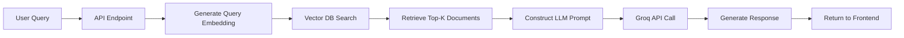

# Backend – Legal RAG System

This folder contains the **backend service** for the Legal AI / Court-Accurate RAG system.  
It is responsible for data ingestion, embedding generation, vector storage, retrieval, and API endpoints used by the frontend.

---

## 🧠 Core Responsibilities

- Ingest legal documents (judgments, cases, sections)
- Clean and preprocess legal text
- Generate embeddings using state-of-the-art models
- Store and query vectors from a vector database
- Retrieve relevant context for user queries (RAG pipeline)
- Serve REST APIs to the frontend

---

## 🛠 Tech Stack

| Technology | Purpose |
|------------|---------|
| **FastAPI** | Backend framework |
| **Uvicorn** | ASGI server |
| **Python 3.10+** | Programming language |
| **ChromaDB** | Vector database for embeddings |
| **Groq API** | LLM inference |
| **Sentence Transformers** | Embedding generation |
| **Pydantic** | Data validation |

---

## 📁 Folder Structure
```text
backend/
│
├── app/
│   ├── rag/
│   │   ├── __init__.py
│   │   ├── glue.py              # ChromaDB connection & initialization
│   │   ├── ingest.py            # Data ingestion pipeline
│   │   ├── llm.py               # Groq LLM integration
│   │   └── query.py             # Retrieval & query logic
│   ├── __init__.py
│   └── main.py                  # FastAPI entry point
│
├── chroma_db/                   # ChromaDB vector storage
│   ├── <uuid>/                  # Collection data
│   └── chroma.sqlite3           # Metadata storage
│
├── cyber_crime_db/              # Alternative vector DB (if used)
│   ├── <uuid>/
│   └── chroma.sqlite3
│
└── README.md                    
```

---

## ⚙️ Setup Instructions

### 1️⃣ Create Virtual Environment
```bash
python -m venv .venv
source .venv/bin/activate   # Linux / macOS
.venv\Scripts\activate      # Windows
```

### 2️⃣ Install Dependencies
```bash
pip install -r requirements.txt
```

### 3️⃣ Environment Variables

Create a `.env` file in the `backend/` directory:
```env
# Groq API Configuration
GROQ_API_KEY=your_groq_api_key_here

# Embedding Model
EMBEDDING_MODEL=sentence-transformers/all-MiniLM-L6-v2

# Vector Database
CHROMA_DB_PATH=./chroma_db
COLLECTION_NAME=legal_cases

# API Configuration
API_HOST=0.0.0.0
API_PORT=8000
```

> ⚠️ **Never commit `.env` to version control!** Add it to `.gitignore`.

---

## 🚀 Running the Backend

### Development Mode
```bash
uvicorn app.main:app --reload --host 0.0.0.0 --port 8000
```

### Production Mode
```bash
uvicorn app.main:app --host 0.0.0.0 --port 8000 --workers 4
```

### Access Points

- **API Base URL:** `http://127.0.0.1:8000`
- **Interactive API Docs (Swagger):** `http://127.0.0.1:8000/docs`
- **Alternative Docs (ReDoc):** `http://127.0.0.1:8000/redoc`

---

## 🔍 Data Ingestion Workflow

### Step-by-Step Process

1. **Prepare Data**
   - Place legal documents (JSON, PDF, TXT) in `../data/`
   - Ensure proper formatting (see data schema below)

2. **Run Ingestion Script**
```bash
   python -m app.rag.ingest
```

3. **What Happens:**
   - Documents are loaded and parsed
   - Text is cleaned and chunked
   - Embeddings are generated using Sentence Transformers
   - Vectors are stored in ChromaDB

4. **Verification**
   - Check `chroma_db/` for generated files
   - Query the API to test retrieval

### Data Schema (cases.json)
```json
[
  {
    "case_id": "CR-2024-001",
    "title": "State vs. John Doe",
    "content": "Full case judgment text...",
    "date": "2024-01-15",
    "court": "Supreme Court",
    "metadata": {
      "judge": "Justice Smith",
      "verdict": "Guilty"
    }
  }
]
```

---

## 🧩 RAG Pipeline Flow


### Detailed Steps

1. **User submits query** via frontend
2. **Backend receives request** at `/api/query`
3. **Query embedding generated** using same model as ingestion
4. **Semantic search** in ChromaDB returns top-k relevant chunks
5. **Context construction** – retrieved chunks + query
6. **LLM inference** via Groq API with legal system prompt
7. **Response formatted** with sources and citations
8. **Frontend displays** answer with references

---

## 📡 API Endpoints

### `POST /api/query`

**Request:**
```json
{
  "query": "What is the punishment for cybercrime under IT Act?",
  "top_k": 5
}
```

**Response:**
```json
{
  "answer": "Under Section 66C of the IT Act...",
  "sources": [
    {
      "case_id": "CR-2024-001",
      "title": "State vs. John Doe",
      "relevance_score": 0.89
    }
  ],
  "metadata": {
    "retrieval_time_ms": 120,
    "llm_time_ms": 1500
  }
}
```

### `GET /health`

Returns server status and database connectivity.

---

## 🛡️ Security Best Practices

- ✅ Use environment variables for API keys
- ✅ Enable CORS only for trusted origins
- ✅ Validate all input using Pydantic schemas
- ✅ Implement rate limiting for production
- ✅ Use HTTPS in production deployments
- ✅ Regularly update dependencies

---

## ⚠️ Important Notes

- **Ingestion is a one-time setup** – Don't run on every server start
- **Vector DB is persisted locally** – Backup `chroma_db/` regularly
- **Designed for court-accurate legal responses** – Not generic summaries
- **ChromaDB uses SQLite** – Not suitable for high concurrency (consider Pinecone/Weaviate for production scale)

---

## 🐛 Troubleshooting

### Common Issues

**Issue:** `ModuleNotFoundError: No module named 'app'`
```bash
# Solution: Run from project root
cd backend
python -m app.main
```

**Issue:** ChromaDB initialization fails
```bash
# Solution: Delete and reinitialize
rm -rf chroma_db/
python -m app.rag.ingest
```

**Issue:** Groq API rate limit exceeded
```bash
# Solution: Implement exponential backoff or upgrade plan
```

---


